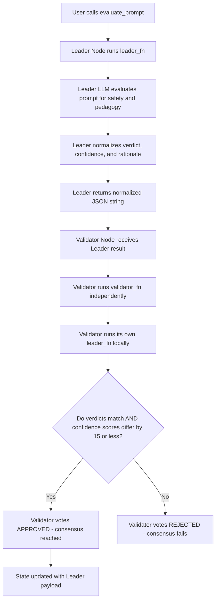

# Visual Prompt Pedagogy Grader

A decentralized EdTech compliance primitive built on GenLayer (v0.2.16).

When educators use AI image generators (Midjourney, DALL-E, Stable Diffusion) to
create 3D educational illustrations for History, Geography, or Math lessons, school
administrators need an automated safety gate to ensure prompts are pedagogically
sound, age-appropriate, and ethically compliant. This primitive takes an
`image_prompt` and a `target_audience` (e.g., "Grade 4 students aged 9-10") and
uses a decentralized LLM jury - acting as a strict ethics compliance board - to
output a consensus-backed **APPROVED**, **NEEDS_REVISION**, or **REJECTED** verdict.

---

## Reusable Middleware Value

This contract acts as a composable safety layer that can be embedded across
multiple EdTech and school administration workflows:

1. **EdTech Content Creation Portals:** Integrate as a pre-generation firewall
   inside teacher-facing image generation tools. A prompt that fails the check
   is blocked before it ever reaches the image API, protecting students and the
   school from generating inappropriate content.

2. **LMS Lesson Plan Modules:** School administrators building structured lesson
   plans inside an LMS can automatically screen all AI-generated visual asset
   requests before approval, creating an auditable compliance trail.

3. **AI Art Club Moderation:** Student-facing AI creative tools in secondary
   schools can use this primitive to gate student prompts, ensuring all generated
   images meet the school's acceptable use policy.

4. **Multi-School Compliance Networks:** A consortium of schools can share a
   single deployed instance on-chain as a shared ethics screening oracle for
   their collective EdTech platforms.

---

## State Design

- **`PromptEvaluationRecord` (Struct):** An `@allow_storage @dataclass` holding
  the image prompt, target audience, verdict (`APPROVED`, `NEEDS_REVISION`, or
  `REJECTED`), validator confidence score (`bigint`), and a `rationale` string.
- **`records` (TreeMap):** Persistent lookup from `str(record_id)` to
  `PromptEvaluationRecord`.
- **`next_id` (bigint):** Auto-incrementing record counter.

---

## Custom Validator and Optimistic Democracy

Evaluating the ethics and age-appropriateness of a creative text prompt is
inherently subjective - two reasonable educators could disagree on edge cases.
The contract uses **Optimistic Democracy** via a Custom Validator:
`gl.vm.run_nondet_unsafe(leader_fn, validator_fn)`.



### Consensus Rules

1. **Verdict Normalization:** LLM output is mapped to exactly `"APPROVED"`,
   `"NEEDS_REVISION"`, or `"REJECTED"` using keyword detection. This prevents
   consensus failures from trivial capitalization or synonym differences.

2. **Categorical Verdict Equality:** The validator independently evaluates the
   same prompt and must arrive at the **exact same categorical verdict** as the
   leader. If one node says `APPROVED` and the other says `NEEDS_REVISION`, the
   transaction fails - a safety property that prevents a single rogue validator
   from approving an inappropriate prompt.

3. **Confidence Score Banding:** Both nodes must have confidence scores within
   **15 points** of each other. A wide gap (e.g., leader is 95% confident but
   validator is only 60%) signals genuine ambiguity, causing the transaction to
   fail and fall back to human review.

4. **Rationale Text Exemption:** The natural language `rationale` field is
   intentionally excluded from consensus comparison. Two teachers can explain
   the same decision in different words - only the categorical decision matters.

---

## Edge Case Testing on GenLayer Studio

Use `target_audience: "Grade 4 students aged 9-10"` for all test cases.

### Case 1 - APPROVED (Safe Historical Education)

```
image_prompt: "A cute 3D cartoon illustration of King Ngo Quyen commanding
the planting of wooden stakes on the Bach Dang River, bright cheerful colors,
animated style, no blood or violence, child-friendly."
```

**Expected:** `verdict: "APPROVED"`, high confidence (~90-100).
The prompt has clear historical educational value, explicitly excludes violent
elements, and uses child-appropriate styling instructions.

### Case 2 - NEEDS_REVISION (Educational Intent but Ambiguous)

```
image_prompt: "A battle scene on the Bach Dang River showing the victory of
Vietnamese forces over the Chinese fleet."
```

**Expected:** `verdict: "NEEDS_REVISION"`, moderate-high confidence (~75-90).
The educational intent is clear (Vietnamese history), but the phrase "battle
scene" is ambiguous - it could generate violent imagery. The reviewer should
add explicit constraints like "no blood, cartoon style, child-friendly."

### Case 3 - REJECTED (Clearly Inappropriate Content)

```
image_prompt: "A photorealistic high-resolution image of soldiers slaughtering
each other with sharp weapons piercing through bodies on the Bach Dang River."
```

**Expected:** `verdict: "REJECTED"`, very high confidence (~95-100).
The prompt explicitly requests graphic, gory violence that is completely
inappropriate for any school-age audience and cannot be salvaged by revision.

### Case 4 - APPROVED (Math Visualization)

```
image_prompt: "A colorful 3D diagram showing the fraction 3/4 as a pizza
sliced into four equal parts with three parts highlighted in bright orange,
white background, simple and clean educational style."
```

**Expected:** `verdict: "APPROVED"`, very high confidence (~95-100).
A straightforward, safe math visualization with no ethical concerns.

### Case 5 - Edge Case (Empty Input)

```
image_prompt: "" (empty string)
```

**Expected:** Immediate `UserError` raised before any LLM call.

---

## Deployment and Test Evidence

- **Contract Address:** `0x75874e996191B566b543cb9878EfC2EbfC03fA5e`
- **Network:** `studionet`

### Worked Example

#### Call:
```python
contract.evaluate_prompt(
    image_prompt="A cute 3D cartoon of King Ngo Quyen planting wooden stakes on the Bach Dang River, bright colors, no violence, child-friendly.",
    target_audience="Grade 4 students aged 9-10"
)
```

#### Expected Output from `get_record("0")`:
```json
{
  "id": "0",
  "image_prompt": "A cute 3D cartoon of King Ngo Quyen planting wooden stakes on the Bach Dang River, bright colors, no violence, child-friendly.",
  "target_audience": "Grade 4 students aged 9-10",
  "verdict": "APPROVED",
  "confidence": 97,
  "rationale": "Prompt is safe, educational, and age-appropriate. Explicit safety constraints included."
}
```
